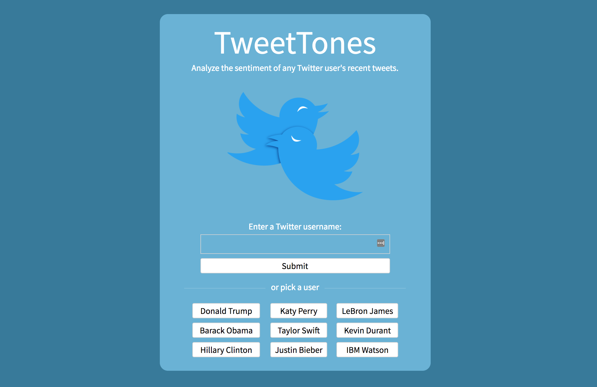
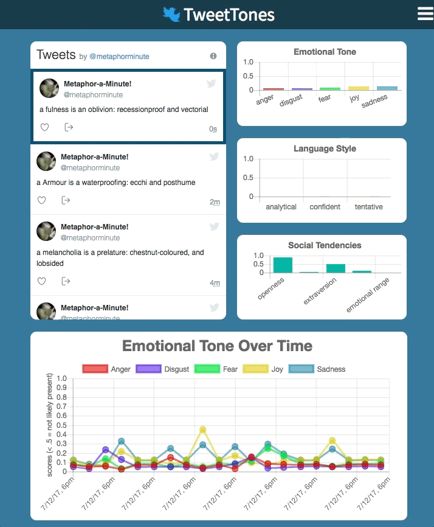

  

    

      <h1>TweetTones</h1>
      <button style="background: #6AB2D5; border: none; border-radius: 5px; padding: 6px 6px 6px 6px"><a style="font-size: 18px; color: white; text-decoration: none" href="https://www.tweettones.me/">Live Link</a></button>
    

    

      <h3>Background</h3>
      
TweetTones is a data visualization web app that uses IBM Watson's Tone Analyzer to display a sentiment analysis of any Twitter user's most recent tweets. Built with HTML5, CSS3 and JavaScript, the app leverages jQuery and Chart.js to provide a clean interface for examining tweet analyses.

    

    

      <h3>Features</h3>
      <ul>
        <li>Convenient browsing of any Twitter user's timeline</li>
        <li>Auto-loading of new tweets (no refresh needed to see most recent tweets)</li>
        <li>Users can load as many old tweets as they want, 20 at a time</li>
        <li>Previously fetched data is persisted to a database for faster load times on revisits</li>
        <li>All data on the page can be downloaded in JSON or CSV format</li>
        <li>Bar charts auto-update when a tweet is clicked on</li>
        <li>Line chart auto-updates whenever more tweets are fetched</li>
        <li>Error handling if a Twitter screenname isn't found
        <li>Custom line chart tooltips identify tweet and date & time</li>
        <li>Responsive to all computer browser window sizings</li>
      </ul>
    

  

### GIFs of Chart Interactivity

##When a tweet is clicked on, bar charts update to show its sentiment data

##Line chart features custom-designed tooltips

##All data on the page can be downloaded in CSV format for use in Excel

##When a user tweets something new, the timeline and linechart auto-update

