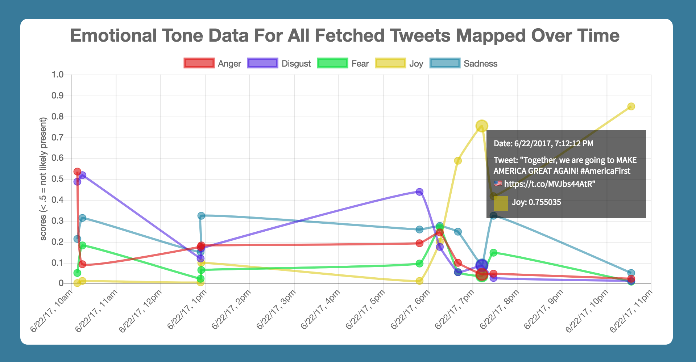

  

    

      <h1>TweetTones</h1>
      <button style="background: #6AB2D5; border: none; border-radius: 5px; padding: 6px 6px 6px 6px"><a style="font-size: 18px; color: white; text-decoration: none" href="https://www.tweettones.me/">Live Link</a></button>
    

    

      <h3>Background</h3>

      TweetTones is a data visualization web app that uses IBM Watson's Tone Analyzer to display a sentiment analysis of any Twitter user's most recent tweets. Built with HTML5, CSS3 and JavaScript, the app leverages jQuery and Chart.js to provide a clean interface for examining tweet analyses.
    

    

      <h3>Features</h3>

      <ul>
        <li>Convenient browsing of any Twitter user's tweet timeline</li>
        <li>Users can load as many tweets as they want, 20 at a time</li>
        <li>Bar charts auto-update when a tweet is clicked on</li>
        <li>Line chart auto-updates when more tweets are fetched</li>
        <li>Error handling if a Twitter screenname isn't found
        <li>Custom line chart tooltips identify tweet and date & time</li>
        <li>Responsive to all computer browser window sizings</li>
      </ul>
    

  

  

